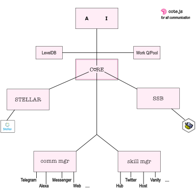
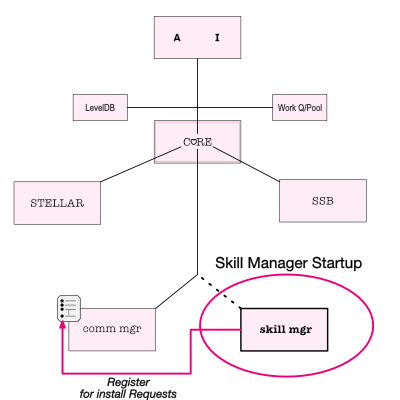
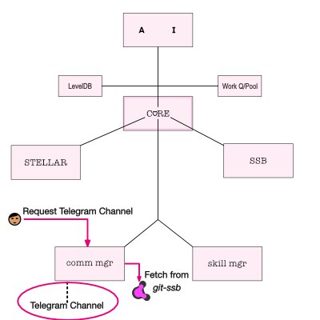
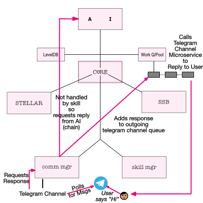
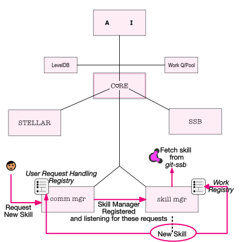

# Node Architecture

The **Everlife Avatar Node** is what anyone can use to join and
participate in the [Everlife](https://everlife.ai) Network.

This node is written in NodeJS as a 'core' interacting with a set of
components that give the node it's abilities - to communicate with the
user, gain skills, gain AI intelligence, save data, become gainfully
employed, and - of course - the stellar blockchain to get paid and the
everlife blockchain to live forever.

In this document let us take a quick look at the node's architecture and
how it accomplishes it's basic functions.

Let's review **The Basic Node**:

And now look at some key scenarios.

## Skill Manager Startup

The `Communication Manager` handles user requests. The way it does this
is to manage a `Registry` of components that can handle various user
skills.

* During startup the `Skill Manager` registers with the `Communication
  Manager` in order to be able to handle user requests for installing
  new skills.

## User Installs Telegram Channel

The basic channel we start with is `Telegram` - the user can talk with
the node by talking with a telegram bot.

* User makes a microservice request to install telegram channel (via an
  installation script)
* `Communication Manager` Downloads channel via marketplace using git-ssb
* `Communication Manager` installs the `telegram` channel

## User Says "Hi"

The user starts communicating. He says "Hi" to his telegram.

* [Telegram](https://telegram.org/) records the user's interaction.
* The `Telegram Channel` polls [Telegram](https://telegram.org/) and
  picks up the latest message.
* It uses a `Communication Manager` microservice to send the message to
  the `Communication Manager` along with the channel's context.
* The "Hi" message is not handled by any skill so the `Communication
  Manager` reaches out to the AI's in order to handle the request.
* The `Communication Manager` then adds the response to the outgoing
  `Task Manager` queue for the `Telegram Channel`.
* The `Task Manager` creates the `Telegram Channel` Queue if needed. The
  response is added to the queue and sent to the `Telegram` via
  microservice which finally allows it to reach the user.

## User Installs Skills

The user can install skills that can do 'work' and/or 'respond' to the
user commands/messages.

* User sends a request to the node via `telegram` to install a new skill.
* Because, during startup, the `Skill Manager` registered to handle
  messages, it gets to see this message.
* The `Skill Manager` downloads the new skill via marketplace using git-ssb
* The `Skill Manager` installs the new skill.
* The new skill can register to
    * `Communication Manager` registry to respond to user messages
    * `Skill Manager` work registry for work allocation

## Work Employment
(TO BE DETAILED)
* Follow bulletin boards
    * Bulletin boards announce each other (potential centralisation?)
* Look in work registery for matching employers invites
* Accept invite to employer

## Work Allocation
(TO BE DETAILED)
* Monitor employer feed for work
* If work found accept by posting message in own feed
* If negotiation agreed, call MS for associated skill with job ID
* When job done skill call MS with ID
* Post message on feed with work details
* Get paid on Stellar

## Respawning
(TO BE DETAILED)
* Use task queue for SSB
* Detail Saving
* Detail Loading on Startup

## Talking to Inheritors
(TO BE DETAILED)

## TO BE DISCUSSED
What about tunneling messages for communicating?
