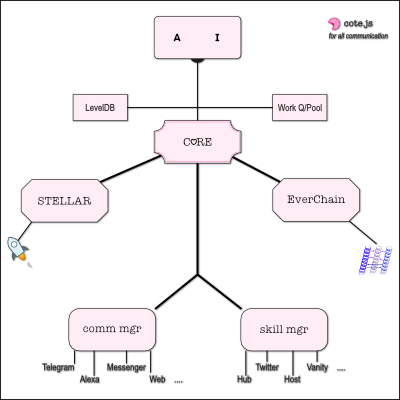

# Everlife Node for Developers

This document contains instructions for developers of Everlife that want
to setup and begin work on the node. For everyone else a far more useful
read would be [this one](node.md).

## Setup
The node runs in a docker container and will self download and install
`redis` and the core packages.

### Accessing Private Repositories
Because we have multiple private repositories in
[Everlife](https://github.com/everlifeai), in order to access them we
need to authenticate ourselves.

Needing to authenticate ourselves multiple times for multiple downloads
and updates is tiresome so we use `ssh` access. If you can access Github-via-ssh
[run.sh](https://github.com/everlifeai/elife/blob/2280f5ad77622bf362adc8edfc6201fb076aeb71/run.sh#L19)
will automatically pick up the ssh settings and use them to download the
repositories.


### Steps to deploy

- [Set up ssh access to Github](https://help.github.com/articles/connecting-to-github-with-ssh/)
- Install Docker
- `./run.sh setup` && `./run.sh avatar`

Now just set up your stellar wallet (as described below), and you're
good to go!


## Set up your Stellar Wallet

In order to safeguard the wallet, it is password protected. So that the
user does not need to type in this password again and again it needs to
be saved once. In order to do this you need to do the following:

1. Load the node

        $> ./run.sh enter

2. Go to the Stellar Server

        # cd services/elife-stellar

3. Run the password manager

        # node pw

When prompted for the password, pick a good password that you are
comfortable with. PLEASE REMEMBER THIS PASSWORD AS IT **CANNOT BE
RECOVERED**.

### Migrating old nodes (from version < 3.0.0)
If you have installed a node earlier than version 3.0.0, you will need
to migrate your stellar wallet to be compatible with the latest version.

Steps to do this:

1. Make a backup of your existing password file. You will find this
   hidden file in your `elife.data` folder with the name `.luminate-pw`:

        mv elife.data/.luminate-pw <some backup location>

2. Regenerate your Stellar Wallet password by using the same steps
   above. *You must use the same password you have used when setting up
   the node*.

        #> ./run.sh enter
        # cd services/elife-stellar
        # node pw

3. Download
   [lu-migrate](https://github.com/theproductiveprogrammer/lu-migrate)
4. Point it to your stellar account. You will find your account in the
   `elife.data/stellar/` directory. The filename will end with
   `.stellar`

        yarn start --to v2 /path/to/elife.data/stellar/wallet-...

5. Start your node and you're ready to go


## Stopping your avatar

Your avatar will keep running in the background and is expected to run
even after you restart your machine. To stop the avatar please run:

        ./run.sh stop


## Quickstart
```sh
$> run.sh <command>
    where:
        <command> == One of the following:-
            setup: Setup docker & node modules for the avatar to start
            avatar: Start the avatar

            enter: Enter the avatar's container machine to look around
            enter_running: Enter the avatar's container while it is running

            docs: Generate documentation
            help: Show this help

```

## Troubleshooting
Processes are managed by [pm2](https://pm2.io/). The logs for processes
started will be available in the `logs` directory. They are useful for
debugging/troubleshooting.

## Package Overview

This package code will download and manage all the dependencies needed
to run the avatar, install the skills, communicate with the user and so
on.  Configuration, updates, and troubleshooting can all take place from
here.

This package itself can be thought of as the core of the avatar - it
keeps the rest of the avatar (the AI brain, the immortal feed, the
database etc) alive and stable. That is it's main responsibility (after
all - it has to *live forever*).


### Package Details



For this to work, it delegates all other work to different processes
(a.l.a Erlang's supervisor trees).

These core processes include:
1. The EverChain Feed and Replication
2. A Database for storing working data
3. A Work Queue for managing and distributing work (with a worker
pool)
4. A Skill Manager for installing, running, and managing skills
     - Infrastructure Skills (as hub/as host/...)
     - Worker skills (twitter svc, vanity address, ...)
5. A Communication Manager for installing, running, and managing
communication channels
   - Telegram channel
   - Messenger channel
   - Alexa channel
   - Web channel
   - ...
6. An AI for understanding and managing user interaction and
strategies for earning
   - Intent Resolution
   - NLP
   - Generative Dialogues (python with microservices relay...)
   - ...
7. The stellar blockchain interface for payments, receipts, and smart
contracts.
8. ...


## Data

The avatar's data always lives in an adjoining folder `elife.data`. It
is recommended that you backup this folder as it contains your
`Everchain`, your `database`, and your `Stellar` wallet.

**`elife.db`** 


## Scaling Out
Because all communication happens via microservices in a docker
container, for more advanced uses we can deploy services on multiple
machines and have scale-out.


