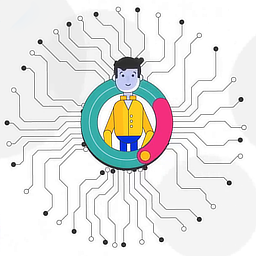

# Managing Your Everlife Avatar

This document contains instructions for setting up and running your
**Everlife** avatar on your own machines.

## Pre-requisites
In order to make it easy for you to deploy, rather than needing you to
install all the various dependencies that the avatar requires, we have
packaged the avatar into a Docker container.

### Mac Pre-requisities

1. Install [Docker](https://store.docker.com/editions/community/docker-ce-desktop-mac)
2. Install Yarn: `brew install yarn`

### Windows Pre-requisities

1. Install [Docker](https://store.docker.com/editions/community/docker-ce-desktop-windows)
2. Install Cygwin: [64 Bit Version](https://www.cygwin.com/setup-x86_64.exe) or
   [32 Bit Version](https://www.cygwin.com/setup-x86.exe)
3. Install [Yarn](https://yarnpkg.com/latest.msi)

To get started, please ensure you have started Docker from Desktop Shortcuts.

## Setup

In order to get a working avatar, you need to set it up and configure
[Telegram](the://telegram.org) communication channel with it. The steps
for doing this are as follows:

1. Unzip the avatar into your `$HOME` directory
1. Run

        ./run.sh setup

1. Go to [Telegram](https://telegram.me/botfather) to create a bot by
   typing

       `/newbot`

    command to create your telegram bot.

1. The BotFather will ask you for a name and username, then generate an
   authorization token for your new bot. The token is a string along the
   lines of 110201543:AAHdqTcvCH1vGWJxfSeofSAs0K5PALDsaw. 
1. We now need to link this new telegram bot with your avatar. To do
   this, simply save the telegram token in
   [../elife.data/cfg.env](../elife.data/cfg.env)

## Set up your Stellar Wallet

In order to safeguard the wallet, it is password protected. So that the
user does not need to type in this password again and again it needs to
be saved once. In order to do this you need to do the following:

1. Load the node

        $> ./run.sh enter

2. Go to the Stellar Server

        # cd services/elife-stellar

3. Run the password manager

        # node pw

When prompted for the password, pick a good password that you are
comfortable with. PLEASE REMEMBER THIS PASSWORD AS IT **CANNOT BE
RECOVERED**.

## Your Data

The avatar's data always lives in an adjoining folder `elife.data`. It
is recommended that you backup this folder as it contains your
`Everchain`, your `database`, and your `Stellar` wallet.

**`elife.db`** 

## Starting and Chatting with Your Avatar

Now that your avatar is set up you can start him up by running

        ./run.sh avatar

Now you can go to your Telegram and start chatting!

## Next steps
1. Join the Everlife network through an **Avatar Hub**.Contact our
   support channel in discord to get your invite code to join the hub
   and inform your avatar that you would like to join this Avatar Hub by
   saying

        /use_invite xxxx

2. Install and try out various skills

        "install calculator"
        "install what-wine"

Feel free to provide us your feedback and issues in our [discord support
channel](https://discord.gg/TDyRSr4).
